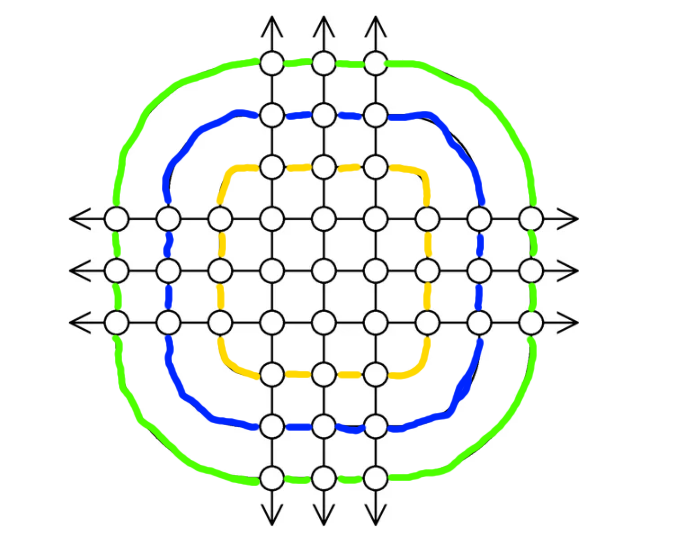
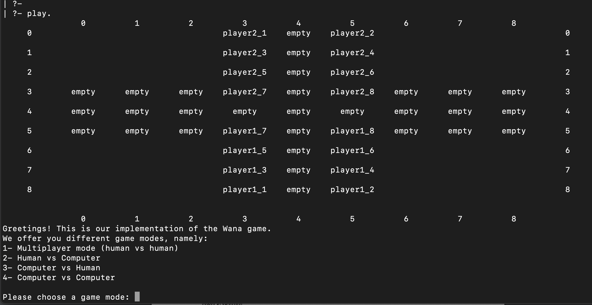
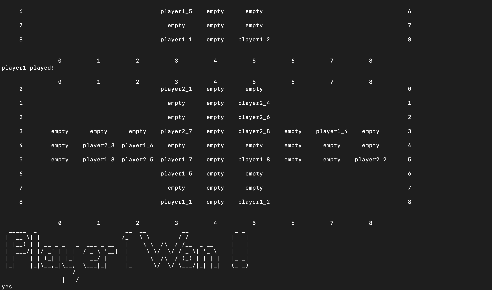
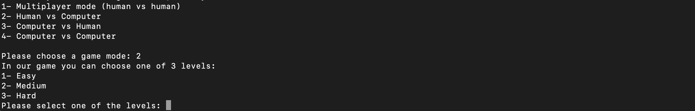
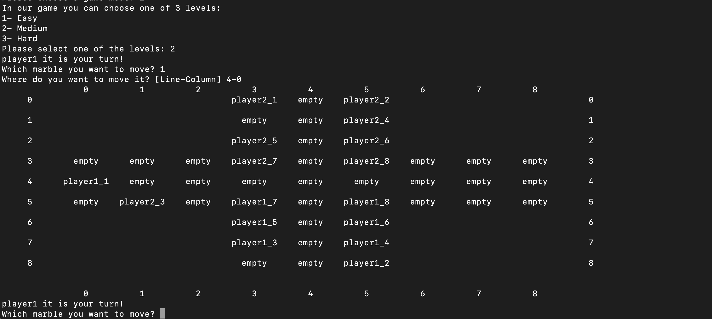
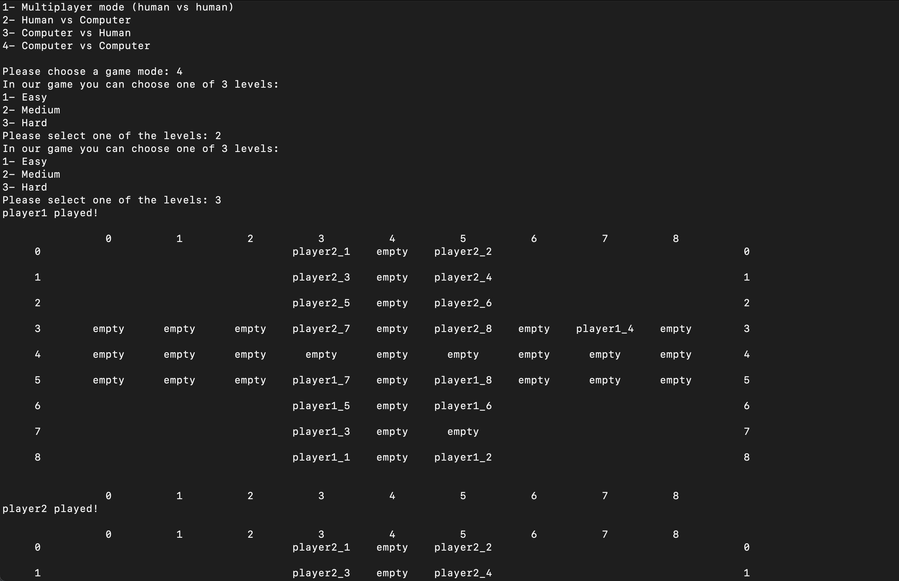

# Implementation of the Wana board game
 Group: Wana_1
 - André Filipe Garcez Moreira de Sousa (up202005277): 50%
 - Pedro Luís Jerónimo Martins Guimarães Fonseca (up202008307): 50%

## Installation and execution
Our game doesn't require additional installation steps. To run it, it is only needed to have SICStus Prolog 4.7.1 installed and use the "play/0" predicate to start the game.

## Game description
Wana is a two player board game. Each of the players has 8 marbles at his disposal and his objective is to completely block one of the opponent's marbles. This can be done by moving your marbles, following a set of rules:
- each player always needs to move a marble when it is his turn
- a marble can move as far as the player wants along a line, but it cannot be moved through or onto another marble.
- a marble can also move along one of three curves in the board, but it cannot be moved through or onto another marble.
- if the moving marble exits the board, it will reappear in the other side of the line it is moving through.

The possible non linear movements (green, yellow and blue) are depicted in the following image:

If, in the beggining of his turn, a player has a marble that cannot be moved, then he lost the game.

The rules of the game can be consulted in the following website: https://boardgamegeek.com/boardgame/364012/wana

## Game Logic
### Internal representation of the state of the game
In our game, we store the current board as a list of lists. Each sublist represents an horizontal line of the board and can contain any of the following atoms:
  - block: this board game isn't played in a rectangular board as the most games. This one is played on a board that has the shape of a cross. Therefore, to easily internally represent the board, every sublist has the same number of elements, but the sections that should be invisible to the player are marked with this atom.
  - empty: this atom represents that a cell is empty, which means that a marble can move through and onto it.
  - playerX_Y: this atom means that the marble Y of the player X is in that cell, therefore no other marble can move through or onto it.

Moreover, the first player is set by using the "player/1" predicate and switching players' turns is done using the next_player/2 predicate.
Finally, when the game mode envolves the computer (in the role of a player), we dinamically store the predicate "bot_difficulty/2" where we associate a player to its difficulty level.

### Game state view
When the user executes the "play/0" predicate, the program presents a menu with the different game modes and then asks the user to select one of them (if the user inputs a number that doesn't match a valid option, then an error message appears and the user has to remake the gamemode selection). After that, if the selected game mode isn't the human vs human mode, then the user will be prompted to set the difficulty of each level of AI. Finally, the board is displayed and the user is asked to select one of his marbles and then to make a move (if the move is invalid, an error message appears and the user is prompted to redo the move).

### Moves Execution
When the user selects a movement, the predicate "valid_move/3" is called. This predicate receives the current board, the initial position of the marble and the final one. After that, if the row index of the movement is equal in both the start position and the final position, the predicate checks if it is a valid left or right movement. If the row indexes are different but the column indexes are the same, then we know that it is a vertical movement and then we check if it is a valid upwards or downwards movement. If none of this cases apply, then the predicate checks if it is a valid non linear movement.
After this verification, the actual movement of the marble is done, using the "move/5" predicate, that returns the new board.

### List of Valid Moves
We implemented two variants of this functionallity: 
- get_all_moves_from_pos/3: receives the current board and the starting position and returns all the possible moves from that position.
- get_all_moves_from_all_pos/3: receives the current board and a list of positions in the board and returns a list of lists where each sublist contains the movements available from the corresponding positon. In other words, the i-th element of the output list corresponds to all the movements possible from the i-th position of the input list.

### End of Game
Our game_over/2 predicate receives the current board and the player that is going to make a move and succeeds if that player lost the game. We didn't follow the project's guide in this case, because the rules of the game clearly state that the player only loses if he cannot make a move in the beggining of his turn, therefore we didn't implement the proposal done in the guide since it doesn't consider which player is currently making a move.

### Board Evaluation
Our evaluation predicate goes through each marble of the player and calculates the number of possible moves of each marble. The same is then done for the opponent. The final score is the sum of all of the player's moves minus the sum of all the opponent's moves. Our reasoning behind this score has to do with the game's goal: trap the other player's marbles; so by checking the amount of available moves we are guaranteeing the freedom of the player and therefore making sure that he is not being trapped in comparison with the other player.

### Computer Move
In our game, we implemented three difficulty levels:
- easy: the computer calculates all the possible moves and chooses one of them randomly.
- medium: the computer calculates all the possible moves and chooses the best one in that situation (Minimax Algorithm with depth 0).
- hard: the computer calculates all the possible moves, using a recursion depth of two in order to make the best move, having in mind how the opponent will react to that move (Minimax Algorithm with depth 1).

## Conclusions
In conclusion, the Wana board game was implemented using SICStus Prolog and offers various game modes for players to choose from. The state of the game and the execution of moves are managed through a series of predicates, which ensure the validity of each move made by the players and also provide the capability to generate a list of all valid moves available to a player at any given time. However, there are a few limitations to the work that has been developed.

One limitation is that the game only allows for two players and there is no option for additional players to join. Additionally, the game is text-based, which may not be as visually appealing as a graphical user interface (GUI) would be. This could potentially limit the game's appeal to some players.

Possible improvements to the game include the inclusion of a GUI to make it more visually appealing and easier to play, as well as the implementation of a more advanced AI opponent with a wider range of difficulty levels as long as a more efficient method to compute the best move (in the AI mode). This would make the game more challenging and engaging for players.

Overall, the implementation of the Wana board game has been successful in providing an enjoyable and challenging experience for players. However, there is still room for improvement, and further development of the game, such as the inclusion of a GUI, could enhance its appeal and usability.

## Bibliography 

- Slides from the lecture classes
- SICStus Prolog 4.7.1 documentation (https://sicstus.sics.se/sicstus/docs/4.7.1/html/index.html)
- BoardGameGeek. (n.d.). Wana. Retrieved from https://boardgamegeek.com/boardgame/364012/wana
